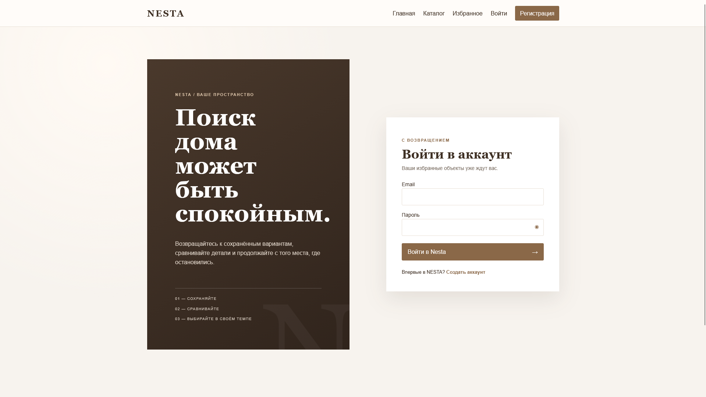
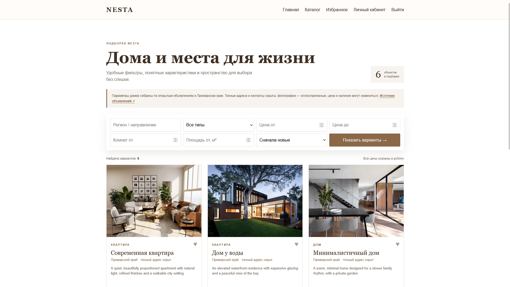
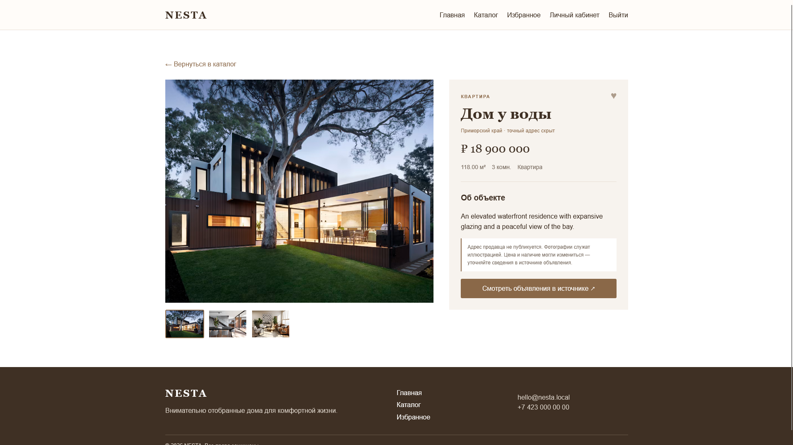

# NESTA

### Найдите место, которое станет домом

Веб-платформа недвижимости с каталогом объектов и инструментами для удобного выбора.

[Открыть сайт ↗](https://nesta.kesug.com) · [Исходный код ↗](https://github.com/xirsoev/nesta-Website-)

> **Демо-проект:** сайт создан для демонстрации. Возможны ошибки, временная недоступность и неисправности отдельных функций.

## О проекте

NESTA помогает просматривать подборку домов и квартир, уточнять параметры поиска и возвращаться к интересным вариантам. Интерфейс выдержан в спокойном редакционном стиле и уделяет внимание фотографиям объектов.

## Возможности

- каталог с фильтрами по региону, типу, цене и числу комнат;
- отдельные страницы с описанием и фотографиями объектов;
- аккаунты пользователей и список избранного;
- административное управление объектами;
- адаптивная вёрстка для небольших экранов.

## Технологии

`PHP` · `MySQL` · `HTML` · `CSS` · `JavaScript`

## Другие экраны

